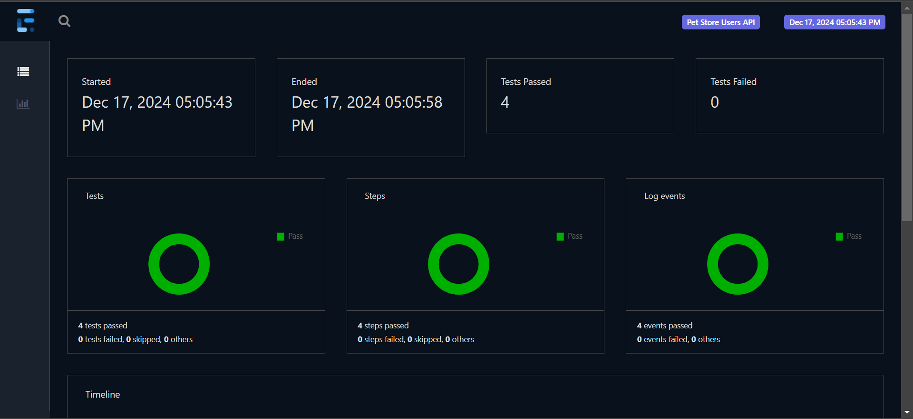

# RestAssured API Automation Project

## Overview
This project is an API automation test suite for the [Swagger Petstore API](https://petstore.swagger.io/), created using **RestAssured** for testing, **TestNG** for test execution, and **Apache POI** for data-driven testing. The test suite covers CRUD operations on user data, validates API responses, and generates reports.

The test suite covers CRUD operations on user data, validates API responses, and generates reports.

## Tools & Technologies
- **RestAssured**: For HTTP requests and response validation
- **TestNG**: For test case execution and reporting
- **Apache POI**: For data-driven testing using Excel sheets
- **Maven**: For dependency management and build automation
- **Java**: Programming language used for test development

## Prerequisites
Before you begin, ensure you have the following installed:
- **Java 8 or above**
- **Maven**
- **IDE (e.g., IntelliJ IDEA, Eclipse)**
- **RestAssured, TestNG, and Apache POI dependencies (managed via Maven)**

## File Descriptions

- **api/endpoints/**
  - `Routes.java`: Contains all the API routes (URLs) used in the tests.
  - `UserEndpoints.java`: Contains methods to perform CRUD operations on users (create, read, update, delete).

- **api/payloads/**
  - `Users.java`: Contains the JSON payload for creating and updating user data.

- **api/tests/**
  - `UserTests.java`: Contains test cases for validating the user API endpoints.
  - `DDTTests.java`: Contains test cases for data-driven testing.
  - `UserTestCases2.java`: Contains test cases using `routes.properties` instead of the `Routes` method.

- **api/utilities/**
  - `XLUtility.java`: Utility class for reading and writing data to/from Excel files.
  - `ExtentReportManager.java`: Manages the generation of ExtentReports.
  - `DataProviders.java`: Provides test data for data-driven testing.

- **src/test/resources/**
  - `log4j2.xml`: Log configuration file for logging test execution details.
  - `routes.properties`: Contains properties (URLs) used in the test cases.

- **testdata/**
  - `userdata.xlsx`: Excel file containing test data for data-driven testing.


## Setup & Installation
1. Clone the repository:
   ```bash
   git clone https://github.com/gangapandey/PetStoreAutomation.git

2. Install the necessary dependencies using Maven:
   ```bash
   mvn clean install

3. You can run the tests from your IDE using the `testng.xml` configuration.

## Test Execution and Reports

- Test cases are executed using **TestNG**.
- Test reports are generated using **ExtentReports**. The reports are saved in the `report/` folder.
- Logs are configured using **log4j2** and can be found in the console output or the `logs/` folder.

## Data-Driven Testing

- The data-driven tests read data from the `testdata/userdata.xlsx` file.
- The tests are executed for different sets of data provided in the Excel file.

## Test Cases

### User CRUD Operations
- **Create User**: Validates the creation of a new user.
- **Get User**: Validates fetching a user by username.
- **Update User**: Validates updating a user's details.
- **Delete User**: Validates deleting a user.

### Data-Driven Testing
- The data-driven tests are located in the `DDTTests.java` file.
- The tests read data from `userdata.xlsx` and validate the API operations using the provided data.

### Test Cases Using routes.properties
- The `UserTestCases2.java` file contains test cases that use `routes.properties` for API routes instead of hardcoding them in the `Routes.java` class.

### Utilities
- **XLUtility**: Used to read/write Excel files for data-driven testing.
- **ExtentReportManager**: Manages the creation and configuration of test execution reports.
- **DataProviders**: Provides test data to the test methods.

### Snapshot



